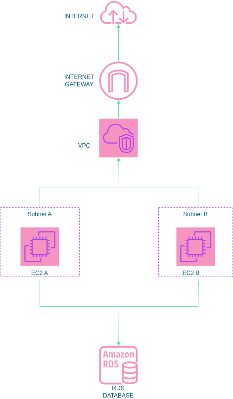

# deploying-secure-ec2-instances-with-shared-rds-database-in-aws
This repository contains Terraform configurations to securely deploy Amazon EC2 instances and a shared Amazon RDS database in AWS.

### Features

  * **Infrastructure as Code (IaC):** The entire infrastructure stack is defined using **Terraform**, making deployment idempotent and easily version-controlled.
  * **Secure Networking:** Provisions a dedicated **Virtual Private Cloud (VPC)**, subnets, and routing tables to isolate resources.
  * **Secure EC2 Deployment:** EC2 application instances are deployed with **least-privilege security groups** to control inbound and outbound traffic effectively.
  * **Shared RDS Database:** Deploys a managed Relational Database Service (RDS) instance designed for secure, private access **only** from the specified EC2 application layer.

-----

### Project Context (KodeKloud)

This project is a practical, real-world implementation and extension of a similar infrastructure deployment scenario initially presented on the **KodeKloud** learning platform.

-----

### Architecture Diagram

The following diagram illustrates the high-level architecture deployed by this Terraform configuration:

  

**Description:**

  * **VPC:** All resources are contained within a single Virtual Private Cloud for network isolation.
  * **Public Subnet:** Hosts the Internet Gateway and optionally public-facing resources like an Application Load Balancer.
  * **Application Load Balancer (ALB):** Distributes incoming traffic to the EC2 instances.
  * **EC2 Instances:** Deployed in private subnets (or public, depending on exact configuration) and serve as application servers. They communicate with the RDS database.
  * **Private Subnet:** Hosts the EC2 instances and the RDS database, preventing direct public access.
  * **RDS Database:** A managed relational database service instance, securely placed in a private subnet, accessible only by the EC2 instances via security group rules.

-----

### Prerequisites

  * **AWS Account**
  * **Terraform** (installed locally)
  * **AWS CLI** (configured with appropriate credentials)

-----